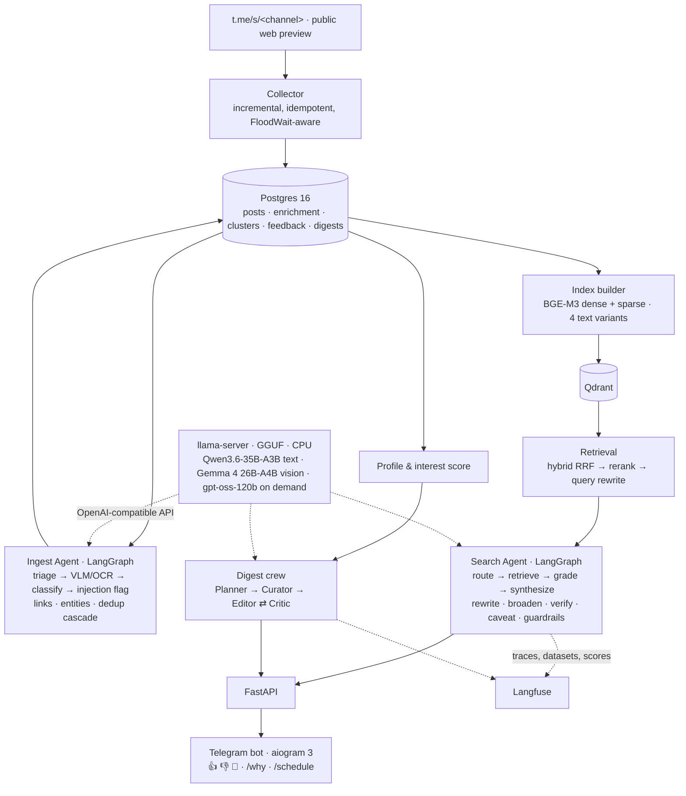

# tg-digest-agent

[](https://github.com/puleon/tg-digest-agent/actions/workflows/ci.yml)

Agentic search and a personalized daily digest over public Telegram channels in three topics —
**science fiction**, **smart humor** and **cinema** — built end to end on **local, CPU-only models**
(AMD Ryzen 9 9950X, 96 GB RAM, no GPU).

The bot is the by-product. The deliverable is the measurement: every component ships with a
numeric quality metric, every experiment is a Langfuse dataset run, and negative results are
reported as such. See [`SPEC.md`](SPEC.md) (Russian) for the full specification and
[`PROGRESS.md`](PROGRESS.md) for the day-by-day engineering log.

## Results at a glance

Every number below comes from a script in `scripts/` over data the reports describe; the
reports list what was *not* achieved next to what was. Status: **day 18 of 18 — final
measurements landing** (rows marked ⏳ are runs still in progress on the box).

| Experiment | Headline | Report |
|---|---|---|
| D1 · CPU serving | Qwen3.6-35B-A3B Q4_K_M: 260 tok/s prefill, 19 tok/s generation; Gemma 4 26B-A4B: 204 / 17 tok/s, verbatim Cyrillic OCR at 262 image tokens; gpt-oss-120b (heavy tier): 142 / 17 tok/s at 63 GiB. Docker ≈ native; SMT and MTP speculative decoding both slower. | [d1-llm-benchmark](docs/experiments/d1-llm-benchmark/README.md) |
| D2 · Corpus | 29 public channels through the `t.me/s` preview (no account): 18 987 posts / 25 939 messages, 22 888 media files (1.7 GB), six months, 2.5 h through a reverse SOCKS tunnel, 0 flood waits. Two parser bugs found later by the dedup features (video dates, reply texts), repaired in place with `collector refresh`. | [PROGRESS D2](PROGRESS.md) |
| D4 · VLM / OCR | 50 hand-checked images: Qwen3.6 CER 0.000, Gemma 4 CER 0.111 (normalized). Cache-free throughput: Qwen 2.6 images/min flat under concurrency, Gemma 4.1 → 8.5 images/min with 4 slots. Vision tier = Gemma 4 (3.3× the throughput, the accuracy gap recorded). | [d4-vlm](docs/experiments/d4-vlm/README.md) |
| D5 · Distillation | Logistic regression on BGE-M3 embeddings vs the LLM teacher, 2 916 posts: topic **κ 0.80** (accuracy 0.864, majority 0.338); is_ad κ 0.40 and quality κ 0.33 with accuracy *below* the majority baseline; spoilers too rare to learn. Two of three targets are negative results — the LLM stays the classifier. | [d5-distillation](docs/experiments/d5-distillation/README.md) |
| D6 · Deduplication | 107 hand-labelled pairs: cheap cascade (exact text, file hash, pHash ≤ 6, forwards) precision 0.765 / recall 0.981 → with a contrast gate, illustration and rubric cannot-link vetoes and an OCR template veto **0.953 / 1.000** on the tuning pairs, **0.947 / 0.947** on a 52-pair hold-out. | [d6-dedup](docs/experiments/d6-dedup/README.md) |
| D7 · Index | BGE-M3 dense + sparse for four indexing variants (text / +OCR / +caption / full) in Qdrant, hybrid RRF, payload filters, duplicates collapsed at query time; 18 987 posts → 29 150 texts embedded in 90 min on the CPU next to the ingest pass; rebuilds re-embed only changed texts. | [PROGRESS D7](PROGRESS.md) |
| D8 · Retrieval ablation | ⏳ ten configurations over 40 queries, 1 856 pooled pairs judged by the local model, 100-pair human calibration (κ), OCR/caption contribution on visual queries. | [d8-retrieval](docs/experiments/d8-retrieval/README.md) |
| D9 · Router | 30 requests: mode accuracy **0.933**, topic 0.867, period 0.967, spoiler flag 1.000; 363 tokens and 12.7 s per request under contention. | [d9-agent](docs/experiments/d9-agent/README.md) |
| D9 · Research tasks | ⏳ 20 multi-step tasks with corpus-checked facts: success rate, steps and tokens per task. | [d9-agent](docs/experiments/d9-agent/README.md) |
| D10 · Chaos | ⏳ five injected failures × 20 runs, graded for correct degradation; the sixth SPEC scenario (invalid VLM JSON) measured on the real pass: 24 of 6 740 posts degraded, 0 failed. | [d9-agent](docs/experiments/d9-agent/README.md) |
| D11–12 · Profile | Score v1 (linear over centroid similarity, topic, channel affinity, engagement, novelty; ad and low-quality penalties) vs a views baseline; the learned v2 ranker was **not built** — 36 onboarding votes are nothing to learn from. ⏳ leave-one-out AUC once the owner's votes are in. | [PROGRESS D11–12](PROGRESS.md) |
| D15 · Faithfulness | ⏳ atomic claims of 12 answers and one digest issue verified against their sources: unsupported share. | [d15-faithfulness](docs/experiments/d15-faithfulness/README.md) |
| D16 · Digest pairwise | ⏳ v1 score vs views baseline judged in both orders by Qwen3.6 and by gpt-oss-120b: wins, position-flip rate, longer-wins rate, cross-family κ. | [d16-digest](docs/experiments/d16-digest/README.md) |
| D17 · Prompt injection | 45 planted posts in 8 classes; heuristic coverage 15/45 → 31/45 at a 0.04 % flag rate on the real corpus. ⏳ attack success rate guard off / on. | [d17-injection](docs/experiments/d17-injection/README.md) |

## What it does

<!-- PENDING: demo transcript — one search answer, one research answer, a digest issue with
/why and feedback, from real runs on the box -->

## Why these topics are technically interesting

- Two of three domains are mostly **visual** → a VLM/OCR branch is mandatory, not a bonus.
- Humor is hard to find by text → an honest **semantic search** problem where BM25 fails.
- Memes and film stills are reposted en masse → **deduplication** is critical and measurable.
- Films and books are entities with external databases → natural **tool use and grounding**.

## Architecture



## Stack

| Layer | Choice | Why |
|---|---|---|
| Collection | Telegram's public web preview (`t.me/s/<channel>`, no account) — Telethon (MTProto) as an optional second source | Bot API cannot read arbitrary public channels; the preview exposes text, ids, dates, full-size photos, albums, forwards, reactions and the numeric channel id |
| Storage | PostgreSQL 16 + SQLAlchemy 2 | Relational links between posts, clusters, feedback |
| Vectors | Qdrant | Self-hosted, payload filters, hybrid search |
| Embeddings / rerank | BGE-M3 / bge-reranker-v2-m3 | Dense + sparse in one model, strong on Russian |
| Model serving | llama.cpp `llama-server` (router mode, GGUF) | OpenAI-compatible API, prefix caching, on-demand model load/unload; CPU-friendly |
| Fast tier (mass ops + VLM/OCR) | multimodal MoE, ~3B active: Qwen3.6-35B-A3B, Gemma 4 26B-A4B ([D1 benchmark](docs/experiments/d1-llm-benchmark/README.md)) | Memory-bandwidth-bound CPU favors few active params; one weight set for text and images |
| Heavy tier (synthesis, judge) | gpt-oss-120b class, loaded on demand | Quality where it matters; does not fit alongside the rest |
| Orchestration | LangGraph | Explicit state graph, checkpoints, interrupts |
| Observability / eval | Langfuse (self-hosted) | Traces, datasets, experiments, scores |
| Interface | FastAPI + aiogram 3 | |
| Infra | Docker Compose, Makefile, uv | `make up` brings everything up |

## What it costs

All inference is local; the box is an AMD Ryzen 9 9950X (16 cores) with no GPU, so the honest
cost unit is **seconds of CPU wall-clock**, and tokens are reported so the same work can be
priced at hosted-API rates. The money column prices the *measured* token counts at published
per-million-token rates (input / output): Claude Haiku 4.5 $1 / $5, Claude Sonnet 5 $2 / $10
(list prices as of 2026-06). Images cost tokens differently on hosted APIs (by pixel count),
so the vision rows are approximate; everything else is a straight multiplication.

| Operation | Tokens in / out | Seconds on the box | $-equivalent Haiku 4.5 | Sonnet 5 |
|---|---|---|---|---|
| Enrich one post (classify + vision when needed, `ingest run`) | 1 260 / 151 (mean over 6 740 humor posts) | 9.9 wall-clock at concurrency 6 (≈ 364 posts/h) | $0.0020 | $0.0040 |
| Enrichment done so far (12 333 posts: humor for six months, cinema for three) | 15.5 M / 1.9 M | ≈ 34 h | $25 | $50 |
| Embed the corpus for search (BGE-M3, 4 variants) | — (29 150 texts) | 90 min at 8 threads | — | — |
| Judge one pooled (query, post) pair (`judge_relevance.v1`) | <!-- PENDING --> | 6.9 at concurrency 2 | | |
| Search-mode question (`agent ask`) | <!-- PENDING --> | | | |
| Research-mode question (search + Wikipedia + page + synthesis) | <!-- PENDING --> | | | |
| One digest issue (planner + curator in code, editor + critic) | <!-- PENDING --> | | | |

## Decisions and deviations from the SPEC

The SPEC (`SPEC.md`, Russian) is the source of truth; every deviation is recorded there or in
`PROGRESS.md` with a date. The ones that matter:

- **Local models only, llama.cpp instead of vLLM, no API model.** Written into the SPEC on day 1.
  The heavy tier is gpt-oss-120b MXFP4, loaded on demand; the fast tier is a 3B-active MoE,
  which is what a memory-bandwidth-bound CPU wants ([D1](docs/experiments/d1-llm-benchmark/README.md)).
- **Telegram's public web preview instead of Telethon.** No collector account could be
  created; `t.me/s/<channel>` exposes everything the schema needs except forward counts. The
  box cannot reach Telegram at all, so collection runs through a reverse SOCKS tunnel from
  the laptop.
- **Wikidata instead of TMDB** for film grounding (TMDB is unreachable from the box); FantLab
  with an Open Library fallback for books. `web_search` is Wikipedia search and is documented
  as such.
- **Two models for two tiers**: Qwen3.6 reads Cyrillic better (CER 0 vs 0.11) but Gemma 4 is
  3.3× faster per image; the full pass would have taken 100 h instead of 30
  ([D4](docs/experiments/d4-vlm/README.md)).
- **Three-month enrichment window** for cinema and scifi (humor has all six months) — the
  owner's call on 2026-09-21: the pipeline does not care about depth, the calendar does.
- **Tools are called by code, not chosen by the model.** The router picks the mode, the graph
  decides which tool runs; the model reads results, grades and writes. Tool-selection accuracy
  (§8.6) is therefore router accuracy, and the writing tool (`update_profile`) is unreachable
  from retrieved content by construction ([D17](docs/experiments/d17-injection/README.md)).
- **No learned interest model (v2)**: with 36 onboarding votes there is nothing to fit; the
  SPEC's buffer rule applies, the features exist for the day feedback does.
- **BM25 baseline without stemming** — a handicap of the baseline, stated where it is used.
- **`lookup_film` is a tested tool the v1 graph never calls**: entity grounding happens at ingest
  time; the agent verifies through Wikipedia + a fetched page. Wiring it into research mode is
  in the roadmap.

## What did not work

- **Distilling the ad and quality classifiers** — κ 0.40 / 0.33, accuracy below the majority
  baseline: ads are lexical, quality is the teacher's own least consistent label
  ([D5](docs/experiments/d5-distillation/README.md)).
- **The embedding stage of dedup** never ran on the corpus: the cheap stages plus vetoes
  reached 0.95 precision at recall 1.0 on the labels, and the one hold-out miss is a trailer
  link vs a still — not something a text embedding fixes.
- **Forwards as dedup ground truth**: 16 source messages forwarded by two or more corpus
  channels — one cluster, too rare to measure the stage.
- **The heuristic injection detector flagged posts *about* AI** («для ИИ») — 15 posts before
  the rule was dropped, 9 after.
- **Ollama ran Gemma 4 55 % faster at generation** than llama.cpp with the same quant type — not
  pursued (one serving stack), recorded as an open question.
- **MTP speculative decoding and SMT** both made the CPU slower.
- **A 7× "speed-up" that was the prompt cache**: llama-server's RAM prompt cache made a repeated
  image set look seven times faster; the VLM benchmark is cache-free for that reason.
- **The "truncated repost" dedup rule** was fitted to a parser artefact (replies carrying the
  parent's text); once the collector was fixed it explained 2 pairs, not 112.
<!-- PENDING: entries from D8 (variants that did not help), D15–D17 as measured -->

## Quickstart

```bash
cp .env.example .env            # fill in secrets and MODELS_DIR
make install                    # uv venv + pre-commit hooks
make up                         # postgres, qdrant, llama-server, langfuse — waits until healthy
make migrate                    # schema
make collect-channels && make collect   # corpus (through the reverse tunnel, see below)
uv run tgdigest ingest run --since 2026-06-21 --concurrency 6   # enrichment (hours, CPU)
uv run tgdigest dedup signatures && uv run tgdigest dedup run    # duplicate clusters
uv run tgdigest index build     # embeddings → Qdrant (idempotent)
uv run tgdigest agent ask "что-нибудь смешное про котов"        # the agent from the terminal
make api                        # HTTP API on :8000 …
make bot                        # … and the Telegram bot against it (BOT_TOKEN)
make test                       # unit tests (no services needed)
```

Services bind to `127.0.0.1` only. When they run on a remote box, `make tunnel` forwards the UIs
(Langfuse `:3000`, Qdrant `:6333`, LLM `:8080`) and `make remote T=<target>` syncs the tree and
runs a make target there. The box itself cannot reach Telegram, so collection runs there with
its egress routed back through the laptop over an OpenSSH reverse SOCKS tunnel
(`make collect-channels`, `make collect ARGS="--topic humor"`; `WEB_PROXY` in the box `.env`).

## Repository layout

```
src/tgdigest/     application package (collector, ingest, dedup, retrieval, agent, digest, bot, api)
config/           channels.yaml — the corpus definition
prompts/          versioned prompts (also managed in Langfuse)
docker/           service configs: llama-server model presets, postgres init
scripts/          benchmarks and one-off experiment runners
docs/experiments/ one report per experiment, with the numbers
tests/            pytest; `integration` marker for tests that need services
```

## Roadmap (beyond the 18 days)

- Image-side retrieval: a SigLIP index of the pictures themselves next to the caption text —
  the visual queries the ablation isolates are the ones it would move.
- Wire `lookup_film` into research mode; entity-aware routing for cinema questions.
- Channel discovery through forwards and mentions; the collector already keeps them.
- A learned interest ranker once feedback exists (the v2 features are in `profile/model.py`);
  distil it on-device with the same harness as D5.
- Multi-turn memory and clarifying questions in the bot.
- A second OCR pass with Qwen3.6 on the images where Gemma found no text, measured against the
  D8 protocol.
- Fill the older three months of cinema and scifi enrichment (`ingest run` without `--since`).

## License

MIT
