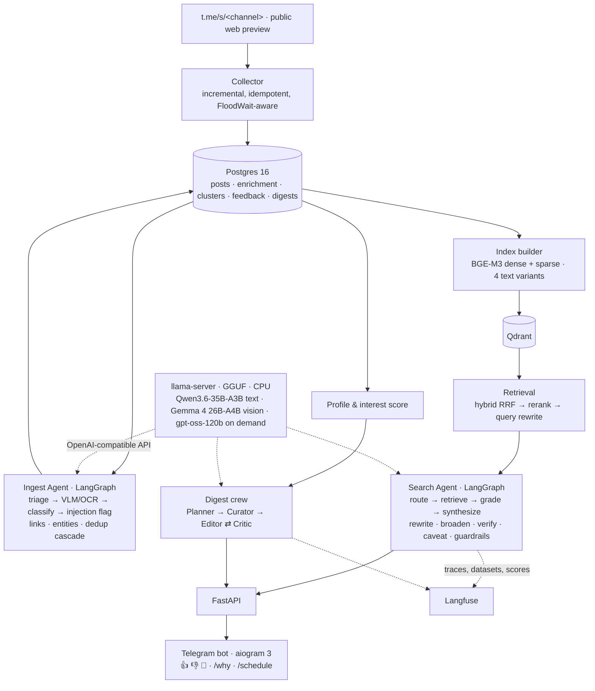

# tg-digest-agent

[](https://github.com/puleon/tg-digest-agent/actions/workflows/ci.yml)

Agentic search and a personalized daily digest over public Telegram channels in three topics —
**science fiction**, **smart humor** and **cinema** — built end to end on **local, CPU-only models**
(AMD Ryzen 9 9950X, 96 GB RAM, no GPU).

The bot is the by-product. The deliverable is the measurement: every component ships with a
numeric quality metric, every experiment is a Langfuse dataset run, and negative results are
reported as such. See [`SPEC.md`](SPEC.md) (Russian) for the full specification and
[`PROGRESS.md`](PROGRESS.md) for the day-by-day engineering log.

## Why these topics are technically interesting

- Two of three domains are mostly **visual** → a VLM/OCR branch is mandatory, not a bonus.
- Humor is hard to find by text → an honest **semantic search** problem where BM25 fails.
- Memes and film stills are reposted en masse → **deduplication** is critical and measurable.
- Films and books are entities with external databases → natural **tool use and grounding**.

## Architecture



## Stack

| Layer | Choice | Why |
|---|---|---|
| Collection | Telegram's public web preview (`t.me/s/<channel>`, no account) — Telethon (MTProto) as an optional second source | Bot API cannot read arbitrary public channels; the preview exposes text, ids, dates, full-size photos, albums, forwards, reactions and the numeric channel id |
| Storage | PostgreSQL 16 + SQLAlchemy 2 | Relational links between posts, clusters, feedback |
| Vectors | Qdrant | Self-hosted, payload filters, hybrid search |
| Embeddings / rerank | BGE-M3 / bge-reranker-v2-m3 | Dense + sparse in one model, strong on Russian |
| Model serving | llama.cpp `llama-server` (router mode, GGUF) | OpenAI-compatible API, prefix caching, on-demand model load/unload; CPU-friendly |
| Fast tier (mass ops + VLM/OCR) | multimodal MoE, ~3B active: Qwen3.6-35B-A3B, Gemma 4 26B-A4B ([D1 benchmark](docs/experiments/d1-llm-benchmark/README.md)) | Memory-bandwidth-bound CPU favors few active params; one weight set for text and images |
| Heavy tier (synthesis, judge) | gpt-oss-120b class, loaded on demand | Quality where it matters; does not fit alongside the rest |
| Orchestration | LangGraph | Explicit state graph, checkpoints, interrupts |
| Observability / eval | Langfuse (self-hosted) | Traces, datasets, experiments, scores |
| Interface | FastAPI + aiogram 3 | |
| Infra | Docker Compose, Makefile, uv | `make up` brings everything up |

## Quickstart

```bash
cp .env.example .env            # fill in secrets and MODELS_DIR
make install                    # uv venv + pre-commit hooks
make up                         # postgres, qdrant, llama-server, langfuse — waits until healthy
make migrate                    # schema
make collect-channels && make collect   # corpus (through the reverse tunnel, see below)
uv run tgdigest ingest run --since 2026-06-21 --concurrency 6   # enrichment (hours, CPU)
uv run tgdigest dedup signatures && uv run tgdigest dedup run    # duplicate clusters
uv run tgdigest index build     # embeddings → Qdrant (idempotent)
uv run tgdigest agent ask "что-нибудь смешное про котов"        # the agent from the terminal
make api                        # HTTP API on :8000 …
make bot                        # … and the Telegram bot against it (BOT_TOKEN)
make test                       # unit tests (no services needed)
```

Services bind to `127.0.0.1` only. When they run on a remote box, `make tunnel` forwards the UIs
(Langfuse `:3000`, Qdrant `:6333`, LLM `:8080`) and `make remote T=<target>` syncs the tree and
runs a make target there. The box itself cannot reach Telegram, so collection runs there with
its egress routed back through the laptop over an OpenSSH reverse SOCKS tunnel
(`make collect-channels`, `make collect ARGS="--topic humor"`; `WEB_PROXY` in the box `.env`).

## Repository layout

```
src/tgdigest/     application package (collector, ingest, dedup, retrieval, agent, digest, bot, api)
config/           channels.yaml — the corpus definition
prompts/          versioned prompts (also managed in Langfuse)
docker/           service configs: llama-server model presets, postgres init
scripts/          benchmarks and one-off experiment runners
docs/experiments/ one report per experiment, with the numbers
tests/            pytest; `integration` marker for tests that need services
```

## Evaluation plan (summary)

Retrieval ablation (BM25 / dense / hybrid / +rerank / +rewrite, and the separate contribution of
OCR and VLM captions on visual topics) · dedup precision/recall on hand-labeled clusters ·
LLM-as-judge validated against human labels (Cohen's κ, position and verbosity bias) · digest
faithfulness via atomic claims · indirect prompt-injection attack success rate before/after
defenses · chaos tests for graceful degradation · agent tool-selection accuracy and step budgets.

Results land in this README as they are produced. **Status: day 7 of 18 — index built, retrieval
evaluation in progress.**

| Experiment | Result |
|---|---|
| [D1 · CPU serving benchmark](docs/experiments/d1-llm-benchmark/README.md) | Qwen3.6-35B-A3B Q4_K_M: 260 tok/s prefill, 19 tok/s generation, 9–28 s per image; Gemma 4 26B-A4B: 204 / 17 / 10.6 s with verbatim Cyrillic OCR at 262 image tokens; gpt-oss-120b MXFP4 (heavy tier): 142 / 17 tok/s at 63 GiB resident. Docker image ≈ native build. SMT and MTP speculative decoding both slower — off. |
| D2 · Corpus | 29 public channels via the `t.me/s` preview (no account needed): 18 987 posts / 25 939 messages, 22 888 media files (1.7 GB), six months, 2.5 h through a reverse SOCKS tunnel, zero flood waits. Two parser bugs found later by the dedup features (video dates, reply texts) — fixed and repaired in place with `collector refresh`. |
| [D4 · VLM branch](docs/experiments/d4-vlm/README.md) | OCR on 50 hand-checked images: Qwen3.6 CER 0.000, Gemma 4 CER 0.111 (normalized). Throughput cache-free: Qwen 2.6 images/min flat under concurrency, Gemma 4.1 → 8.5 images/min with 4 slots. Vision tier = Gemma 4, text tier = Qwen3.6. |
| D7 · Index | BGE-M3 dense + sparse per indexing variant (text / +OCR / +caption / full) in Qdrant, hybrid RRF, payload filters, dedup collapsed at query time; 18 987 posts → 28 876 unique texts embedded in 90 min on the CPU alongside the ingest pass; rebuilds re-embed only changed texts. |
| [D6 · Deduplication](docs/experiments/d6-dedup/README.md) | 107 hand-labelled pairs: the cheap cascade (exact text, file hash, pHash ≤ 6, forwards) scored precision 0.765 / recall 0.981; a contrast gate for dark frames, an "illustration" cannot-link veto (same photo under different stories) and a rubric-caption veto gave **0.932 / 1.000** on the tuning pairs and **0.947 / 0.947** on a 52-pair hold-out; 29 of 30 pairs the vetoes split are real non-duplicates. The labels also exposed two parser bugs (video dates, reply texts) that had inflated "verbatim reposts". |

## License

MIT
